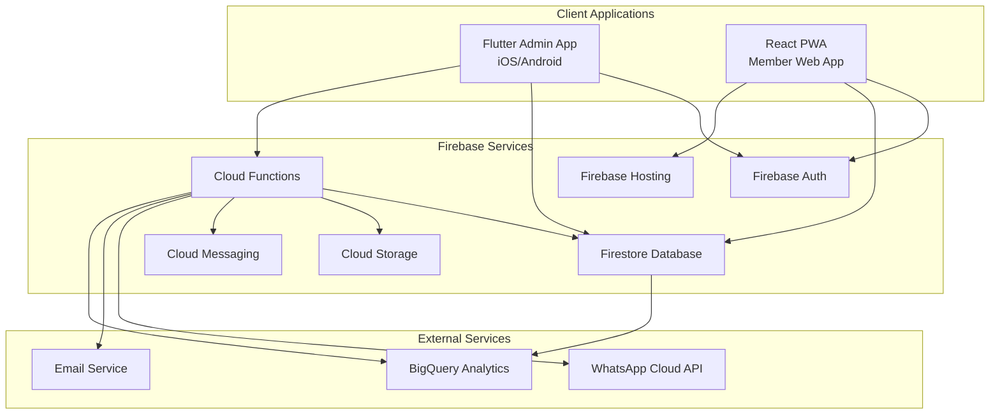

# System Architecture
## Group Trip Expense Splitter

---

## 🏗️ High-Level Architecture



## 📱 Application Architecture

### Admin App (Flutter)
```
┌─────────────────────────────────────┐
│              Presentation           │
│  ┌─────────────┐ ┌─────────────────┐│
│  │   Screens   │ │    Widgets      ││
│  └─────────────┘ └─────────────────┘│
└─────────────────┬───────────────────┘
                  │
┌─────────────────┴───────────────────┐
│            Business Logic           │
│  ┌─────────────┐ ┌─────────────────┐│
│  │ Providers   │ │   Use Cases     ││
│  │ (Riverpod)  │ │                 ││
│  └─────────────┘ └─────────────────┘│
└─────────────────┬───────────────────┘
                  │
┌─────────────────┴───────────────────┐
│               Data                  │
│  ┌─────────────┐ ┌─────────────────┐│
│  │Repositories │ │   Data Sources  ││
│  │             │ │  (Firebase)     ││
│  └─────────────┘ └─────────────────┘│
└─────────────────────────────────────┘
```

### Member PWA (React)
```
┌─────────────────────────────────────┐
│               UI Layer              │
│  ┌─────────────┐ ┌─────────────────┐│
│  │ Components  │ │     Pages       ││
│  │             │ │                 ││
│  └─────────────┘ └─────────────────┘│
└─────────────────┬───────────────────┘
                  │
┌─────────────────┴───────────────────┐
│            State Management         │
│  ┌─────────────┐ ┌─────────────────┐│
│  │React Query  │ │   Context API   ││
│  │             │ │                 ││
│  └─────────────┘ └─────────────────┘│
└─────────────────┬───────────────────┘
                  │
┌─────────────────┴───────────────────┐
│              Services               │
│  ┌─────────────┐ ┌─────────────────┐│
│  │ API Client  │ │  Firebase SDK   ││
│  │             │ │                 ││
│  └─────────────┘ └─────────────────┘│
└─────────────────────────────────────┘
```

---

## 🗄️ Database Architecture

### Firestore Collections Structure

```
/users/{userId}
├── role: "admin" | "member"
├── email: string
├── phone?: string
├── displayName: string
├── createdAt: timestamp
├── lastLoginAt?: timestamp
└── preferences: {
    notifications: boolean,
    theme: "light" | "dark",
    language: string
}

/trips/{tripId}
├── name: string
├── origin: string
├── destination: string
├── startDate: timestamp
├── endDate: timestamp
├── currency: string
├── status: "active" | "closed" | "archived"
├── adminId: string (reference to /users/{userId})
├── createdAt: timestamp
├── updatedAt: timestamp
├── settings: {
    allowMemberCategories: boolean,
    requireReceiptApproval: boolean,
    autoApproveExpenses: boolean
}
├── /members/{memberId}
│   ├── userId: string (reference to /users/{userId})
│   ├── displayName: string
│   ├── email: string
│   ├── phone?: string
│   ├── dependentsCount: number
│   ├── joinedAt: timestamp
│   ├── isActive: boolean
│   └── permissions: string[]
├── /categories/{categoryId}
│   ├── name: string
│   ├── icon: string
│   ├── color: string
│   ├── createdBy: string (reference to /users/{userId})
│   ├── isActive: boolean
│   └── createdAt: timestamp
└── /dependents/{dependentId}
    ├── parentMemberId: string
    ├── name: string
    ├── relationship: string
    ├── age?: number
    └── createdAt: timestamp

/expenses/{expenseId}
├── tripId: string (reference to /trips/{tripId})
├── amount: number
├── currency: string
├── description: string
├── categoryId: string (reference to /trips/{tripId}/categories/{categoryId})
├── paidBy: string (reference to /users/{userId})
├── participants: string[] (references to users/dependents)
├── customSplit?: {
│   [userId: string]: number
│   }
├── receiptUrls: string[]
├── location?: {
│   latitude: number,
│   longitude: number,
│   address: string
│   }
├── status: "pending" | "committed" | "rejected"
├── adminComment?: string
├── createdBy: string (reference to /users/{userId})
├── createdAt: timestamp
├── updatedAt: timestamp
├── approvedBy?: string (reference to /users/{userId})
└── approvedAt?: timestamp

/balances/{balanceId}
├── tripId: string (reference to /trips/{tripId})
├── memberId: string (reference to /users/{userId})
├── totalPaid: number
├── totalShare: number
├── netBalance: number (positive = owed money, negative = owes money)
├── lastUpdated: timestamp
└── expenseBreakdown: {
    [categoryId: string]: {
        paid: number,
        share: number
    }
}

/notifications/{notificationId}
├── userId: string (reference to /users/{userId})
├── tripId?: string (reference to /trips/{tripId})
├── type: "expense_approved" | "expense_rejected" | "trip_closed" | "member_joined"
├── title: string
├── body: string
├── data?: object
├── read: boolean
├── createdAt: timestamp
└── expiresAt?: timestamp

/audit_logs/{logId}
├── tripId?: string
├── userId: string
├── action: "CREATE" | "UPDATE" | "DELETE"
├── resource